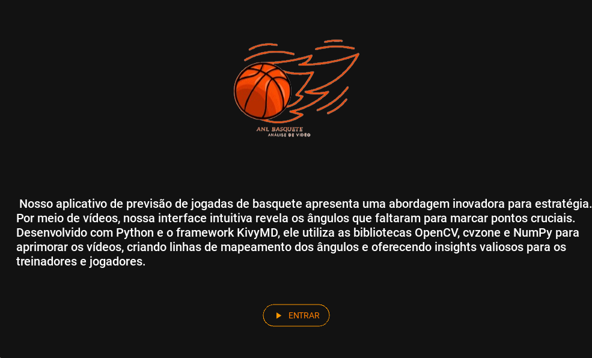
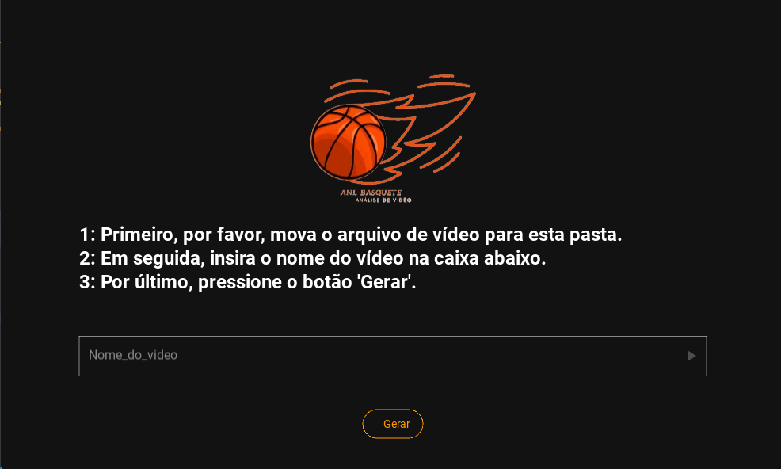

# Prevendo_basquete

Nosso aplicativo de previsão de jogadas de basquete apresenta uma abordagem inovadora para estratégia. Por meio de vídeos, nossa interface intuitiva revela os ângulos
que faltaram para marcar pontos cruciais. Desenvolvido com Python e o framework KivyMD, ele utiliza as bibliotecas OpenCV, cvzone e NumPy para aprimorar os vídeos, criando 
linhas de mapeamento dos ângulos e oferecendo insights valiosos para os treinadores e jogadores.

  

## Funcionalidades

- or meio de vídeos, nossa interface intuitiva revela os ângulos
que faltaram para marcar pontos

## Tecnologias Utilizadas

- python

## Contribuições
Contribuições são bem-vindas! Se você deseja contribuir para este projeto, sinta-se<be> à vontade para abrir uma issue para discutir suas ideias ou enviar uma pull request com
melhorias.
